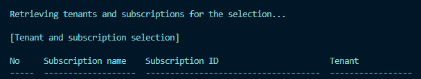
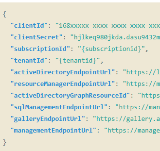
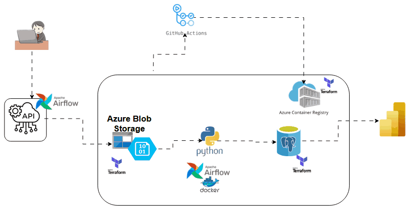

## Data Engineering Hackathon - USA Top 1000 College 

### Background Story
Among the biggest challenges for university aspirants in the United States is finding accurate, up-to-date, and relevant information about colleges and universities. 

With thousands of schools nationwide, students often struggle to compare institutions based on critical factors such as tuition costs, graduation rates, admission requirements, and available programs.

### Overview
A data engineer have being called upon to a data pipeline that automates the extraction, transformation, and storage of university-related information from the [USA College Scorecard API.](https://collegescorecard.ed.gov/data/api-documentation/)

The data pipeline  is expected to retrieve data for the top 1000 schools in the U.S.A based on ranking and store the data in a structured format suitable for analytics

### Project Usage
This section walks  through setting up the project, including repository setup, Astro CLI configuration, and credential management in Azure Cloud, Terraform and Github Actions.

### Prerequisites
- Python 3.10 or higher
- Git
- Terraform
- Azure Cloud ( Blob Storage, Azure PostgreSQL, Container Registry, Azure Entra ID )
- Docker Desktop
- Apache Airflow via [Astro CLI](https://docs.astronomer.io/astro/cli/install-cli)


#### Step 1: Clone the Repository

```bash
# Clone the repository
git clone https://github.com/ioaviator/DE_Hackathon_USA_College_Info.git

# Navigate to project directory
cd DE_Hackathon_USA_College_Info
```
#### Step 2: Download Azure CLI and the Login to Azure from the command line (Bash)

```bash 
  az login 
```
Take note of the subscription id and keep it safe


#### Step 3: Provision Azure  resource with Terraform
<br>

Login to [Azure Portal](https://portal.azure.com)  
Manually create a resource group, storage account and container, which will be used to store terraform state file remotely

```bash
  backend "azurerm" {
    resource_group_name  = "backend_tf"
    storage_account_name = "hackathonstatebackend"
    container_name       = "tfstate"
    key                  = "terraform.tfstate"
  }
```

Navigate to the terraform directory. Create a file `credentials.txt` and paste your Azure subscription id. Add this file to `.gitignore` file. <br >
In the `providers.tf`, reference the `credentials.txt` file

**N.B: Always comment out the subscription_id line before pushing to GitHub. This is to prevent Github Actions from throwing an error**


```bash
  # Configure the Microsoft Azure Provider
provider "azurerm" {
  features {}

  subscription_id = file("credentials.txt")
}
```

`change directory (cd)` into the terraform directory from the terminal. Run the following commands

- Initialize: `terraform init`
- Plan: `terraform plan -out main.tfplan`
- Apply: `terraform apply --auto-approve main.tfplan`

#### Step 4: Create and Configure environment variables

Create a `.env` file at the project root directory. Add this file to `.gitignore`

Visit the [Score card website](https://collegescorecard.ed.gov/data/api-documentation/) to generate an API key

Generate Azure blob `Account Key` and `Connection String`

Acount Key: 

```bash
az storage account keys list -g <ResourceGroupName> -n <StorageAccountName>
```

Connection String: 
```bash
az storage account show-connection-string --name <StorageAccountName> --resource-group <ResourceGroupName> --subscription <SubscriptionID>
```

Add database username and password credentials
```bash
API_KEY=LP3PqxbWKk
URL=<score-card-api-url>

## Azure blob storage account key
ACCOUNT_KEY="STAZ3hyCEMLaETuw=="
## Azure blob storage connection string
CONN_STRING="DefaultEndpointsProtocol=https;AccountName=<storage_account_name>;AccountKey=<blob_storage_account_key>;EndpointSuffix=core.windows.net"

## Azure postgres db username and password
DB_USERNAME=adminadmin
DB_PASSWORD=1e3q98q
```

#### Step 5: Virtual Environment Configuration

  Create a python virtual environment
  `python -m venv venv`

------------------------------------------
  *Activate virtual environment*

  Windows: 
  ```bash
  source venv\Scripts\activate
  ```

  Linux: 
  ```bash
  source venv/bin/activate
  ```

-------------------------------------

  ***Install Project Requirements***

  ```bash
    pip install -r requirements.txt
  ```
  Using Astro
```bash
# Install Python packages
astro dev python package-install <package-name>

# Install packages in your Astro project
astro dev python package-install requirements.txt
```

#### Step 6: Start Project
```bash
astro dev start
```
To run the pipeline maually without orchestration.
From the project root directory
```bash
python main.py
```
<br>

## Github Actions Deployment

#### Generate environment secrets
`Azure Client Id`, `Azure Client Secret`,`Azure Tenant Id`, `Registry Login Server`, `Registry Username`, `Registry Password`

- Create a Service Principal or App Registration

```bash
az ad sp create-for-rbac --name "SP-GitHubAction" --role contributor --scopes /subscriptions/{subscriptionid} --sdk-auth
```
- Copy the `client id`, `client secret`, `subscription id`, `tenant id` keys, and keep them secured
<br>

  

- Generate credentials for an Azure Container Registry.
```bash
az acr credential show -n <ContainerRegistryName>
```
- Copy first password and username values
- Registry LOGIN_SERVER value is `<YourAzureContainerName>.azurecr.io`

### Creating required GitHub secrets

- To create the secret in GitHub, goto github repository and then click on “Settings.” Click on “Secrets and Variables,” “Actions,” and “New repository secret.”
- `ADMIN_LOGIN` and `ADMIN_PASS` represent your Azure PostgreSQL credentials. Make sure to enable FIREWALL RULES for your PostgreSQL database in Azure portal

<br>

Here are the expected secrets to be added to Github 
```bash
REGISTRY_LOGIN_SERVER='Azure Container Registry Server (e.g: ContainerRegistryName.azurecr.io)'
REGISTRY_USERNAME='Azure Container Registry Username'
REGISTRY_PASSWORD='Azure Container Registry Password'
ADMIN_LOGIN='Azure PostgreSQL login name'
ADMIN_PASS='Azure PostgreSQL password'
AZURE_CLIENT_ID='Azure Entra ID(Active Directory) Client Id'
AZURE_CLIENT_SECRET='Azure Entra Id Client Secret'
AZURE_SUBSCRIPTION='Azure Subscriptiion Id'
AZURE_TENANT_ID='Azure Tenant Id'
```


=================================================

## Data Pipeline Architecture



### Explore [Power BI Data Visualization](https://app.powerbi.com/view?r=eyJrIjoiMDJjNDBhNjgtN2U4NC00MmQ3LTg3MzUtNDZiNDE4MmM0ZDRkIiwidCI6ImRmODY3OWNkLWE4MGUtNDVkOC05OWFjLWM4M2VkN2ZmOTVhMCJ9)

--------------------------------
### Key Components

- Data Ingestion: API data extraction

- Storage Layers:
  - Raw Layer: Azure Blob Storage (Parquet format)
  - Processed Layer: Azure PostgreSQL

- Orchestration: Apache Airflow [Astronomer]
- Data Transformation: Python
- Infrastructure as Code: Terraform
- CI/CD: GitHub Actions
- Container Registry: Azure Container Registry

<br>

==================================
## Choice of Tools

**Cloud Service (Azure)**

  - **Azure Blob Storage**: Serves as the data lake for storing raw data in Parquet format, offering durability and cost-effectiveness for data storage.
  
  - **Azure PostgreSQL**: Serves as the data warehouse where transformed data is loaded. Analysts can connect to the warehouse and build visualizations
  
  - **Azure Container Registry**: Hosts our Docker containers

**Orchestration (Apache Airflow)**

  - Manages data pipeline dependencies and orchestration.

**Infrastructure as Code (Terraform)**
  - Automation of infrastructure provisioning, updates, and management. 
  - Manage infrastructure across different providers, simplifying management and orchestration

**Version Control & CI/CD (GitHub & GitHub Actions)**

  - **GitHub:** Maintains code versions and enables collaboration among teams.
  - **GitHub Actions:** Automates testing, building, and deployment processes.
  - Implements automated cloud  infrastructure deployment, code quality checks and image builds.

**Data Visualization (Power BI)**
  - Creates interactive dashboards for data analysis.
  - Connects directly to Azure PostgreSQL for data visualization.
  - Provides easy-to-use data visuals for business users to interpret data and understand data.
------------------------------

#### **Code Formatting and Style**

**black**
  - Automatically formats code to meet PEP 8 standards
  - Enforces consistent Python code formatting

**flake8**
  - Lints Python code for potential errors
  - Checks for style guide violations
  - Ensures code quality standards

 **isort**
  - Automatically sorts Python imports
  - Imports are grouped into sections (standard library, third-party, local)
  - Maintains consistent import ordering
  - Improves code readability